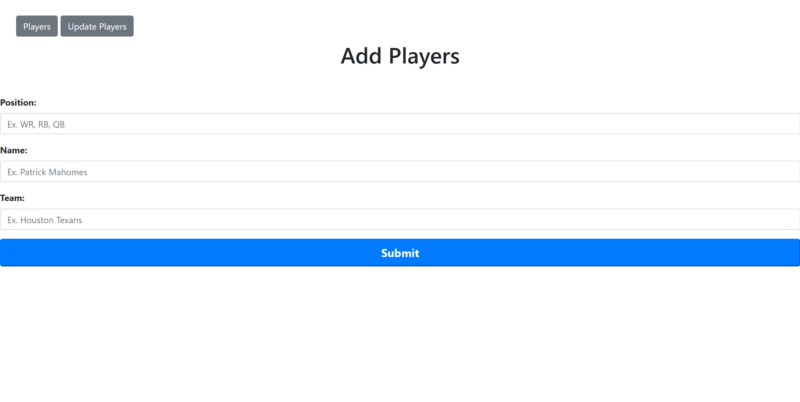
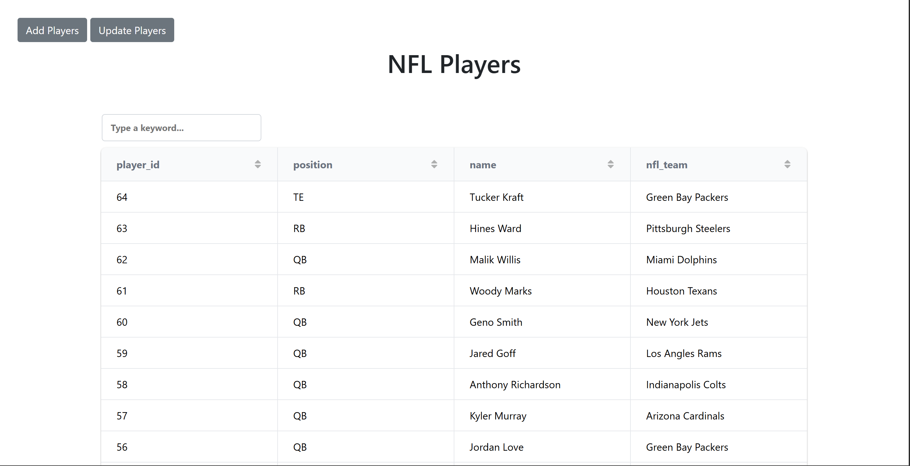
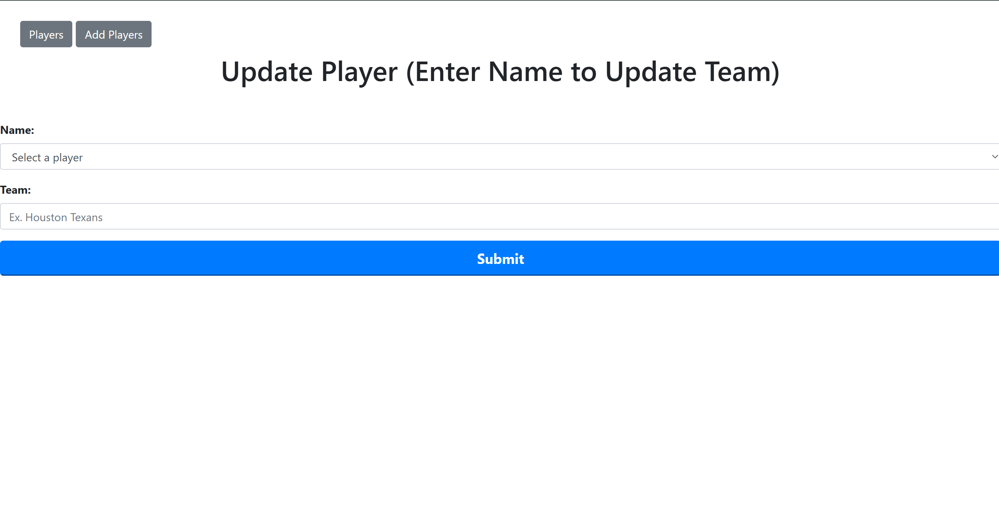

# Frontend

## 1. Fantasy Football Trade Tracker

**Description:**  
This is the frontend of the application built using **HTML, CSS, and JavaScript**. It provides a responsive user interface that allows users to interact with data from a backend API.

**Tech Stack:**
- HTML5
- CSS3
- JavaScript
- Bootstrap
- jQuery

---

## 2. Table of Contents
- Installation & Setup
- Usage Instructions
- API Integration
- Contributing
- License

---

## 3. Installation & Setup

### Prerequisites
- A web browser (Chrome, Edge, Firefox)
- (Optional) Code Editor of choice

### Steps
```bash
git clone https://github.com/ColinD13/Application_FrontEnd_Downing/tree/main
cd frontend-project

```
View Html file in browser

## 4. Usage Instructions

- To add a player go to the add a player page and submit the information into the form

- To view players go to the view players page. Thre ability to search for a player and to navigate through pages is available

- To edit players go to the update players page and enter the players name to edit their team


## 5. API Integration

- Players
    -GET-https://application-backend-downing.onrender.com/api/players
    -POST-https://application-backend-downing.onrender.com/api/players/(Json Body)
    -PUT-https://application-backend-downing.onrender.com/api/players/(Json Body)

## 6. Contributing Guidlines

- Fork the main branch, create a new branch, make changes, commit and push, create a PR
- Use standard coding practices and leave comments on potentially confusing aspects

## 7. Licenses
This project is licensed under the MIT License.